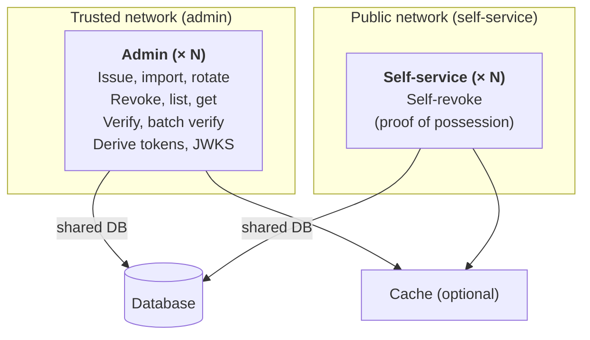

# Deployment modes

Talos ships as a single binary that can run in three modes: all-in-one, admin only, and self-service
only. The mode you choose controls which gRPC and HTTP surfaces the process exposes — the data store
and configuration are identical.

## Modes

| Command              | Mode       | Endpoints exposed                                                                    |
| -------------------- | ---------- | ------------------------------------------------------------------------------------ |
| `talos serve`        | All-in-one | Admin and self-service                                                               |
| `talos serve admin`  | Admin only | Admin: issue, import, list, get, update, rotate, verify, revoke, derive tokens, JWKS |
| `talos serve public` | Public     | Self-service: proof-of-possession self-revocation                                    |

The admin and self-service surfaces share the same database: admin writes keys, self-service exposes
only self-revocation today, and both modes use the same on-process verifier when verification is
needed.

## When to split admin and self-service

Run admin and self-service as separate processes when you need:

- **Different network boundaries**: admin should never be reachable from the public internet.
  Splitting the processes makes that boundary obvious in your ingress configuration.
- **Different scaling profiles**: self-service traffic (and any future self-service surface) is
  typically higher-volume and read-heavy. Admin traffic is lower-volume and write-heavy.
- **Different deployment cadences**: rolling out an admin-only change should not require redeploying
  the public-facing self-service fleet, and vice versa.

If none of these apply, prefer the simpler all-in-one mode (`talos serve`).

## Architecture

Both modes share the same database. Admin writes keys and exposes verification, JWKS, and lifecycle
operations. Self-service exposes only proof-of-possession self-revocation.



## Commands

```bash
# Run admin and self-service in a single process (development, small deployments).
talos serve --config config.yaml

# Run only the admin endpoints (management, verification, JWKS, token derivation).
talos serve admin --config config.yaml

# Run only the public-facing endpoints (proof-of-possession self-revocation).
talos serve public --config config.yaml
```

`talos serve admin` emits a startup warning that admin endpoints have no built-in authentication.
Configure a trusted proxy in front of it before sending traffic — see
[Admin protection](../security/admin-protection.md).

## Configuration

Both deployments use the same configuration file or environment variables. The key difference is
**network exposure**, not config schema.

### Admin process

Bind to an internal interface only and place a trusted proxy in front:

```yaml
serve:
  http:
    host: "10.0.0.1"
    port: 4420
```

### Self-service process

Self-service can accept traffic from the public network. The default cache configuration is
sufficient — self-revocation throughput is bounded by client behavior, not cache hit rate.

```yaml
serve:
  http:
    host: "0.0.0.0"
    port: 4420
```

## Network policies

- **Admin**: restrict to internal services only. The admin server has no built-in authentication;
  every reachable caller is implicitly authorized. See
  [Admin protection](../security/admin-protection.md) for supported patterns.
- **Self-service**: can accept traffic from any source. The self-service surface validates
  proof-of-possession on every request.

## See also

- [Admin protection](../security/admin-protection.md) — required deployment patterns for the admin
  surface.
- [Security hardening](../security-hardening.md) — broader hardening guidance.
